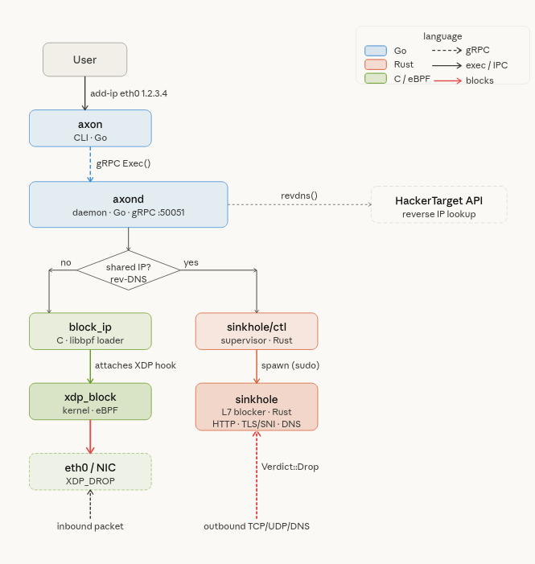

# axon


A lightweight network blocking daemon for Linux. Block IPs and domains at L3 (XDP/eBPF) or L7 (HTTP, TLS, DNS) depending on whether an IP is shared across multiple hosts.

---

## Architecture



- **axon** — CLI client (Go). Sends commands to the daemon over gRPC.
- **axond** — Daemon (Go). Resolves FQDNs, checks reverse DNS via HackerTarget API, decides L3 vs L7, and syncs rules every 5 min.
- **block_ip** — C loader that writes IPs into a BPF hash map and attaches an XDP hook to the interface.
- **xdp_block** — eBPF kernel program. Drops packets at the earliest point in the stack based on source IP.
- **sinkhole/ctl** — Rust supervisor. Manages the domain list and restarts the sinkhole process on changes.
- **sinkhole** — Rust L7 blocker. Intercepts traffic via `iptables NFQUEUE` and drops by HTTP `Host`, TLS SNI, or DNS query name.


# Benchmark

## Axon vs OpenSnitch — Benchmark Comparison

Axon is an FQDN-aware web filtering firewall using XDP/eBPF for non-shared IPs and a custom Rust L7 SNI inspection layer for shared IPs.

---

## Results

| Run | Axon Throughput | OpenSnitch Throughput | Axon Latency | OpenSnitch Latency | Axon CPU | OpenSnitch CPU | Axon RAM | OpenSnitch RAM |
|-----|---|---|---|---|---|---|---|---|
| 1 | 70.81 Mbps | 79.06 Mbps | 117.84 ms | 95.10 ms | 21.63% | 22.13% | 3.75 MB | 0.50 MB |
| 2 | 71.56 Mbps | 65.60 Mbps | 113.86 ms | 107.38 ms | 20.92% | 19.17% | 2.00 MB | 1.00 MB |
| 3 | 60.37 Mbps | 57.37 Mbps | 106.72 ms | 178.60 ms | 17.52% | 16.86% | 5.25 MB | 0.00 MB |
| 4 | 60.39 Mbps | 33.24 Mbps | 129.67 ms | 165.71 ms | 17.08% | 15.37% | 2.75 MB | 2.75 MB |
| **Avg** | **65.78 Mbps** | **58.82 Mbps** | **117.02 ms** | **136.70 ms** | **19.29%** | **18.38%** | **3.44 MB** | **1.06 MB** |

---

## Analysis

### Throughput — Axon wins
Axon averages **65.78 Mbps vs 58.82 Mbps** (+12%). More importantly, OpenSnitch collapses to 33 Mbps in run 4 while Axon stays stable above 60 Mbps across all runs.

### Latency — Axon wins
Axon averages **117 ms vs 137 ms** (−14%). OpenSnitch spikes to 178 ms and 165 ms in runs 3–4, suggesting it degrades under sustained load. Axon remains consistent.

### CPU — Roughly equal
Axon uses marginally more CPU on average (19.3% vs 18.4%). The difference is within noise range across runs.

### RAM — OpenSnitch wins
OpenSnitch uses significantly less memory (1.06 MB vs 3.44 MB delta). Axon's SNI inspection and XDP state tracking carry a higher memory footprint.

---

## Verdict

| Metric | Winner |
|---|---|
| Throughput | ✅ Axon (+12%, stable) |
| Latency | ✅ Axon (−14%, consistent) |
| CPU | ➖ Tie |
| RAM | ✅ OpenSnitch (−69%) |
| Stability | ✅ Axon (OpenSnitch degrades in runs 3–4) |

Axon outperforms OpenSnitch on throughput, latency, and stability. OpenSnitch's only advantage is lower memory usage. If RAM is not constrained, Axon is the better choice — particularly under sustained load where OpenSnitch shows significant performance degradation.


---

## Requirements

- Linux kernel with XDP support
- `iptables` with NFQUEUE
- Go, Rust, clang/libbpf (for building)
- `sudo` access (XDP and NFQUEUE require root)

---

## Build

```bash
make          # builds axon, axond, block_ip, and sinkhole
```

---

## Usage

```bash
# Start the daemon
sudo ./axond

# Add a network interface to manage
axon add-iface eth0

# Block an IP directly (L3 — XDP drop)
axon add-ip eth0 1.2.3.4

# Block a domain (L3 or L7 depending on shared hosting)
axon add-web eth0 example.com

# Block domains from a file
axon add-web-file eth0 blocklist.txt

# Check current state
axon status
axon status eth0

# Remove rules
axon remove-ip eth0 1.2.3.4
axon remove-web eth0 example.com
```

---

## How blocking is decided

When adding a domain, axond resolves it to an IP and performs a reverse DNS lookup:

- **IP is exclusive to that domain → L3 block.** The IP is added to the XDP BPF map. Packets are dropped in the kernel before they reach userspace.
- **IP is shared with other domains → L7 block.** The domain is passed to sinkhole, which inspects HTTP `Host` headers, TLS SNI fields, and DNS queries via NFQUEUE, issuing a `Verdict::Drop` only for matching hostnames.

